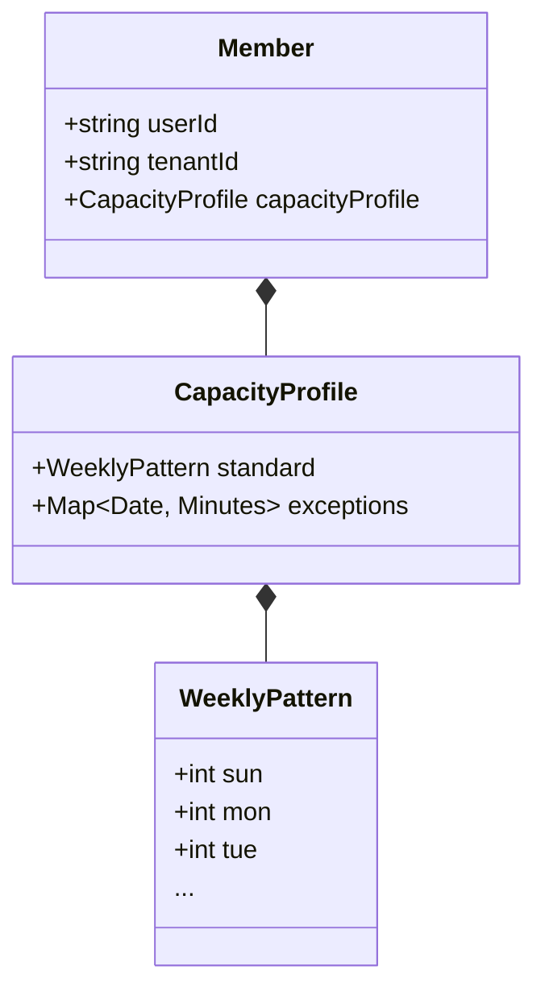

# 複数所属時代のキャパシティ管理 (Multi-Tenant Capacity Management)

## 1. 核心思想 (Core Philosophy)
**「私の時間は、会社ごとに区切られている。」**

現代の働き方は多様化しています。1つの会社にフルタイムでコミットする人もいれば、複数の会社（テナント）に所属し、曜日や時間帯で役割を使い分ける人もいます。
JBWOS（Judgment-Free Business Work OS）は、システムが「こうあるべき」を押し付けるのではなく、**「ユーザーの現実（Reality）」をそのまま受け入れ、鏡のように映し出す**ことを使命とします。

### 原則
1.  **審判しない (Non-Judgmental)**: 「働きすぎ」「足りない」とシステムが判定しない。設定されたキャパシティ（供給）とタスク量（需要）のバランスを色（Intensity）で可視化するのみ。
2.  **現実に即す (Mirroring Reality)**: 「毎週月曜はA社、火曜はB社」「今日は急用でA社を休んだ」といった現実の振る舞いを、正確かつ簡単に記録・反映できる。
3.  **プライバシー (Data Sovereignty)**: A社での稼働設定がB社に見えてはならない。キャパシティ設定はあくまで「ユーザー個人」の持ち物である。

---

## 2. 機能仕様 (Features)

### A. テナント別週間パターン (Tenant-Specific Weekly Pattern)
ユーザーは所属するテナントごとに、**「標準的な関わり方（ベースライン）」** を定義できます。

- **設定単位**: テナント（会社） × ユーザー
- **入力形式**: 曜日ごとの稼働時間（Minutes/Hours）
- **例**:
  - **Main Corp**: 月〜金 8時間
  - **Side Project Inc**: 土 4時間
  - **Community Org**: 水 2時間

### B. 日次例外オーバーライド (Daily Exception Override)
現実は定型通りには進みません。カレンダーなどの日常画面から、**「その日限りの変更」** を直感的に行えます。

- **操作**: カレンダーの日付セルを操作（右クリック/タップ）。
- **入力**: スライダーまたは数値入力で、その日のキャパシティを修正。
- **ユースケース**:
  - 祝日だが、締切前なので稼働する。
  - 体調不良で早退したため、キャパを減らす。
  - 急な打ち合わせで、予定外のテナント業務が発生した。

---

## 3. ユーザー操作フロー (User Flow)

### Scene 1: 入社・参加時の初期設定
1. ユーザーは `Personal Settings` または `Members Screen` を開く。
2. 所属リストから対象のテナント（例: "藤田建具店"）を選択し、「稼働設定」ボタンを押す。
3. **「週間スケジュール設定」** モーダルが開く。
4. 曜日ごとのスライダーを動かし、「月・水・金は8時間」のように設定して保存する。
5. システムはこれを基に、向こう数年分の `Capacity` を計算上のベースラインとして保持する。

### Scene 2: 日々の調整 (The "Ryokan" Experience)
1. ユーザーは **量感カレンダー (Ryokan Calendar)** を眺める。
2. 特定の日（例：2月14日）が真っ赤（過負荷）になっていることに気づく。
3. 「あ、この日は祝日だけど、仕事するつもりだった」と思い出す。
4. 日付セルを右クリックし、**「キャパシティ調整」** を選択。
5. "藤田建具店" のキャパを `0h` (祝日デフォルト) から `6h` に変更する。
6. セルの背景色が赤から薄い色（適正負荷）に変化する。ユーザーは安心を得る。

---

## 4. データ構造イメージ

