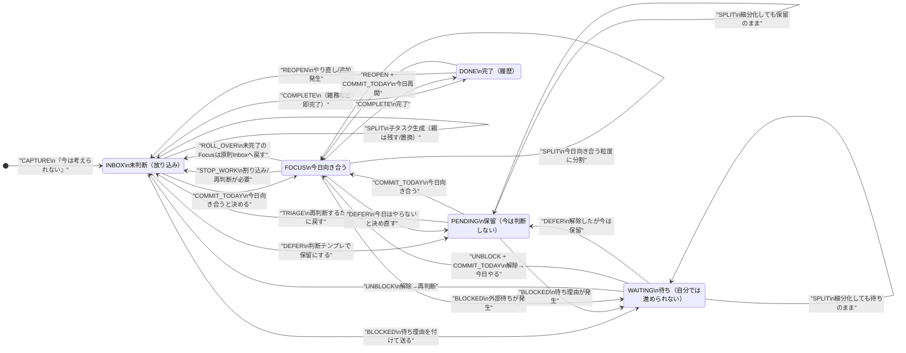

# JBWOS 状態遷移（State Machine）定義 v1.0

目的：開発AIが「状態（Status）」「遷移（Transition）」「UI表示（Sections / Views）」を混同せず実装できるよう、**状態機械として明文化**する。

---

## 0. 用語（冒頭で必ず固定する）

### 永続（Persistent）
- **アプリを閉じても保持される状態**（DBに保存される状態）。
- 例：`status = "inbox"`、`deadline`、`myDeadline`、`estimateDays`、`parentId`、`childrenCount` など。

### 一時（Ephemeral）
- **画面表示・フィルタ・並び替え等の一時的な状態**（UI state / ViewModel state）。
- 例：Focusビュー/パノラマビュー切替、展開/折りたたみ、検索クエリ、選択中アイテムなど。

### 納期（Due Date）
- **現実の締め切り**（顧客/元請け/制度等によって固定される日付）。

### マイ期限（My Deadline）
- **自分が「手前で完了しておきたい」期限**（防波堤・備え完了日）。

### 期限フック（Deadline Hook）
- 「判断を再開するタイミング」を決めるためのフック。
- 実装上は `hookGranularity = today|tomorrow|this_week|next_week|later` のように**粒度タグ**として扱い、**罪悪感を生むアラート**にはしない。

### 判断の重さ（Decision Weight）
- 「決めるのが重い」度合い（心理的コスト）。
- `decisionWeight` として別軸に保持（作業の重さと混ぜない）。

### 作業の重さ（Workload / Estimate）
- `estimateDays`（例：1.0〜1.5日）や `estimateHours` 等で表現。
- **量感カレンダーの着色**はこの軸を使う。

---

## 1. 永続Status（DBに保存される「状態」）

Status は **1つだけ**（単一フィールド）を原則とする。  
UIの「セクション」や「ビュー」はこの status と他の属性（期限フック/最近編集/親子など）から導出する。

- `inbox` ：未判断（放り込み）
- `pending`：保留（今は判断しないと決めた）
- `waiting`：待ち（自分では進められない）
- `focus` ：今日向き合う（今日やる候補〜着手の入口）
- `done`  ：完了（履歴）

※ `history` は Status ではない。UI上の表示（doneの一覧など）。

---

## 2. Focus内部の「軽い表現」（永続にする/しないの判断）

要件：**「Focus内での 着手中/未着手 を軽く表現」**  
ここは2案ある：

### 案A（推奨：永続で持たない）
- `status="focus"` のまま、UI/VMで `isInProgress` を一時的に管理。
- 例：タイマー開始中だけ「着手中」バッジ、画面を閉じたら消える。
- メリット：罪悪感を固定化しない、実装が軽い。
- デメリット：翌日に「昨日着手してた」が残らない。

### 案B（必要なら採用：永続で持つ）
- `focusState = "not_started" | "in_progress"` をDBで保持。
- メリット：翌日も着手中が残る。
- デメリット：固定化が「未着手の罪悪感」になり得る。

本ドキュメントの State Machine は **案A前提**で描く。  
（案Bが必要になったら `focus` のサブステートを永続化するだけで拡張可能）

---

## 3. 遷移イベント（Trigger一覧）

下のイベント名は実装で関数/Action名に使える粒度で定義する。

- `CAPTURE`：今は考えられない → とりあえず放り込む
- `TRIAGE`：判断して振り分ける（inboxの整理）
- `DEFER`：保留へ送る（判断テンプレ適用）
- `BLOCKED`：待ちへ送る（理由がある）
- `COMMIT_TODAY`：Focusに入れる（今日向き合う）
- `START_WORK`：今から取りかかる（UI表現のみ：案A）
- `STOP_WORK`：中断（割り込み等）
- `COMPLETE`：完了へ
- `REOPEN`：doneから戻す（やり直し/追加発生）
- `UNBLOCK`：waiting解除（材料到着・返信など）
- `SPLIT`：細分化（子タスク生成）
- `MERGE`：統合（タスク統合）
- `SET_DUE`：納期設定
- `SET_MY_DUE`：マイ期限設定
- `SET_ESTIMATE`：目安日数/工数設定
- `SET_HOOK`：期限フック粒度設定
- `ROLL_OVER`：日付が変わる（翌日扱い）
- `NO_WORK_DAY`：今日は何もしない日宣言（UIポリシー）

---

## 4. 状態機械（Mermaid）

> Mermaidは日本語を **必ずダブルクォート**で囲む（パース崩れ防止）。



---

## 5. 重要ポリシー（実装の意思決定ポイント）

### 5.1 「Focusは今日やるリストか？」
結論：**「今日やることリスト」を作るための入口**であり、同時に**今日向き合う対象の上限を守る枠**。  
- Focusに入れた時点で「今日は十分」メッセージは出す  
- ただし現実対応として **Focus上限は「件数」ではなく「枠」**で調整する（後述）

### 5.2 Focus上限（現実対応設計）
「Readyに1件入ったら十分」は思想として正しいが、現実の粒度（細分化）で破綻する。  
そこで上限を **2層**にする。

- **Focus枠（上限2）**：原則は2プロジェクト/2親タスクまで
- **Focus内ステップ（無制限に近い）**：子タスク/細分化ステップは増えてOK  
  - UIは1行表示で圧縮  
  - ただし「今日は何ステップやるか」を**量で示さない**（罪悪感を避ける）

実装ヒント：
- `focusSlots` は「親タスク（project）」単位でカウント
- `child tasks` はスロットカウントしない、または軽量カウント（例：1/4）

### 5.3 「未判断が溜まりすぎた」耐久
- Inboxが増えたら **隠す**のではなく、**壊れない導線**を用意する
- ポリシー例（UIのみ）：
  - Inbox件数>10 → 「今日は1件だけ判断すればOK」表示
  - Inbox件数>30 → Inboxは折りたたみデフォルト、検索/期限フックで浮上

### 5.4 「明日締切がInboxに埋もれたら？」問題
設計方針：**Statusを勝手に変えない**、ただし **危険カードだけ浮上**させる。

- DBのstatusは `inbox` のまま
- ViewModelで `isUrgent = (dueDate <= tomorrow) OR (myDeadline <= tomorrow)` を計算
- Inbox折りたたみでも、**Urgent Strip（危険帯）**として上に1行で出す  
  - 表現は「危険」「遅延」ではなく「判断を再開するフック」  
  - 例：ラベル「明日までに判断」

### 5.5 「無視した通知」の扱い（罪悪感を生まない）
- 通知を無視してもステータスを変えない
- システムは「未読/未対応」を責めない
- 表現は「再掲」：通知ログではなく **次回の自然浮上**に使う

---

## 6. Pendingに入れる「判断テンプレ」（遷移の条件を固定化）

Pendingは「後回し」ではなく、**“今は判断しない”を決めた状態**にする。  
そのために `DEFER` の際、必ずテンプレを1つ選ぶ（選択肢は短い）。

### Pendingテンプレ（例）
1. `"材料/情報が揃ってから判断"`（→揃ったらINBOXへ）
2. `"来週まとめて判断"`（→期限フック next_week）
3. `"月末に判断"`（→期限フック later + タグ）
4. `"今は受けない可能性が高い"`（→受注可否の保留）
5. `"夢タスク：週1だけ進める"`（→定期フック this_week）

実装としては
- `pendingReason`（短いenum）
- `hookGranularity`（today/tomorrow/this_week/next_week/later）

---

## 7. 画面（UI）と状態（Status）の対応表

| UIセクション/画面 | 中身の基本 | 永続Status | 補助条件（例） |
|---|---|---|---|
| Dashboard: Inbox | 未判断 | inbox | urgent計算で浮上 |
| Dashboard: Waiting | 待ち | waiting | waitingReason必須 |
| Dashboard: Pending | 保留 | pending | pendingReason + hook |
| Dashboard: Focus | 今日向き合う | focus | focusSlots制御 |
| Dashboard: 履歴 | 完了 | done | 期間フィルタ |
| Today画面（※存在する場合） | Focusの別ビュー | focus | UIの切替のみ |

---

## 8. 実装に落とす最小データ（推奨）

```ts
type Status = "inbox" | "pending" | "waiting" | "focus" | "done";

type HookGranularity = "today" | "tomorrow" | "this_week" | "next_week" | "later";

type PendingReason =
  | "need_info"
  | "next_week_review"
  | "month_end_review"
  | "maybe_decline"
  | "dream_weekly";

interface TaskItem {
  id: string;
  title: string;

  parentId?: string | null;

  status: Status;

  // real world
  dueDate?: string | null;     // 納期
  myDueDate?: string | null;   // マイ期限
  estimateDays?: number | null;

  // decision layer
  decisionWeight?: 1 | 2 | 3 | null;

  // defer control
  hook?: HookGranularity | null;
  pendingReason?: PendingReason | null;

  // waiting
  waitingReason?: string | null;

  // bookkeeping
  createdAt: string;
  updatedAt: string;
}
```

---

## 9. 次の作業（開発AIが決めるべき実装タスク）
- 既存 `Ready/Today` ロジックを `focus` に統合し、`ROLL_OVER` ルールを実装
- Inbox折りたたみでも urgent を浮上させる ViewModel層の追加
- `pendingReason + hook` の強制入力（最短1タップ）
- focusSlots（親タスク基準）の制約ロジック（UIブロック）
- 「今日は何もしない日」モード（NO_WORK_DAY）をUIに入れるか判断

