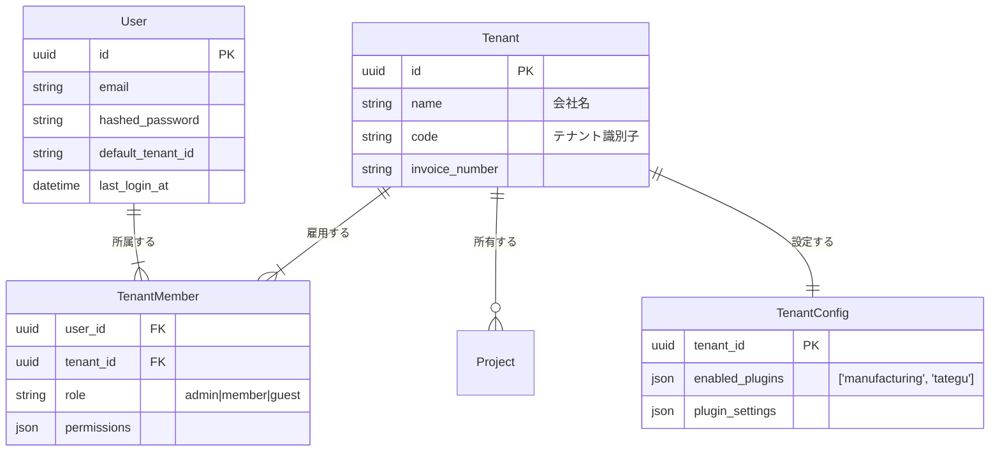

# マルチテナント・プラグイン アーキテクチャ設計書

## 1. 概要
JBWOSは、一人のユーザーが複数の組織（Tenant）に所属し、それぞれの組織で異なる役割や機能セット（Plugin）を利用することを前提としたアーキテクチャを採用する。

## 2. コア・データモデル

### 2.1 Entity Relationship

### 2.2 User vs Tenant
*   **User (個人)**: システムを利用する主体。認証情報のオーナー。
*   **Tenant (会社)**: 契約の主体。データ、プロジェクト、プラグイン設定のオーナー。
*   **Separation**: UserはTenantのデータを「参照・操作」する権限を持つだけであり、データはUserではなくTenantに帰属する。Aさんが退職（脱退）しても、Aさんが作成したプロジェクトはTenantに残る。

## 3. プラグイン適用アーキテクチャ

### 3.1 Tenant-Level Activation
プラグインのON/OFFは、**UserごとではなくTenantごとに**設定される。

*   **シナリオ**:
    *   会社A（Tategu Co.）: Manufacturing Plugin = ON
    *   会社B（Design Inc.）: Manufacturing Plugin = OFF
    *   User Xは両方に所属。

*   **挙動**:
    *   User Xが「会社A」のワークスペースを開いている時 → 製造業向けUI（成果物タブなど）が有効化される。
    *   User Xが「会社B」のワークスペースに切り替えた時 → 製造業向けUIは無効化され、標準JBWOS UIとなる。

### 3.2 UI Integration
プラグインは主に以下のポイントで標準UIを拡張する。

1.  **Sidebar/Navigation**: プラグイン固有のメニュー追加（例:「工場設定」「資材管理」）。
2.  **Project Detail Tab**: プロジェクト詳細画面へのタブ追加（例:「成果物(Deliverables)」タブ）。
3.  **Settings**: 設定画面へのタブ追加。

## 4. Cross-Tenant Volume (量感の共有)

JBWOSの思想である「今日はこれで十分」判断を支援するため、**「1人のユーザーの稼働状況（Capacity）」は全テナントで共有**されるべきである。ただし、**「何をしているか（Content）」は厳格に分離**されなければならない。

### 4.1 Masked Capacity Logic
*   **計算式**:
    `AllocatableCapacity(TenantA) = DailyBaseHours - PrivateEvents - Tasks(TenantB) - Tasks(TenantC)`

*   **UX表現**:
    *   Tenant Aのカレンダーにおいて、Tenant Bで埋まっている時間は「**他社業務 (External Work)**」または単なる「**稼働不可 (Blocked)**」としてグレーアウト表示される。
    *   詳細（プロジェクト名やタスク内容）は一切表示されない。

*   **メリット**:
    *   **Overwork防止**: 会社Aの管理者は、Aさんは空いているように見えても「実は他社で忙しい」ことが（量として）分かるため、無茶なアサインを回避できる。
    *   **Privacy保護**: 会社Aは、Aさんが会社Bで何の仕事をしているかは知る由もない。

## 5. 移行・実装ステップ
1.  **Schema Migration**: `tenant_members` テーブル作成、`tenants` テーブルへの設定カラム追加。
2.  **Auth Logic Update**: ログイン時に所属テナントリストを取得し、コンテキスト（`current_tenant`）を初期化する処理の実装。
3.  **Plugin System**: フロントエンドにおける機能フラグ（Feature Toggle）実装。`TenantConfig` に基づきUIを出し分ける仕組みの構築。
4.  **Capacity Logic**: バックエンドでの予定取得時に、他テナントの予定を合算して「Masked Block」として返すAPI実装（将来フェーズ）。
