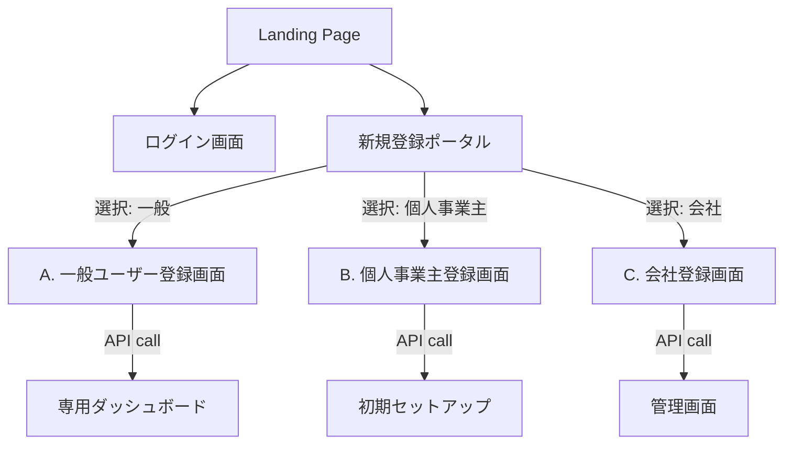

# 詳細設計書: ユーザー登録・会社登録画面 (Registration UI Design)

## 0. 画面遷移フロー (Screen Flow)



## 1. 新規登録ポータル (Registration Portal)
ユーザーが自身のタイプを選択するゲートウェイ画面。

*   **レイアウト**: 3つの大きなカードを並べる。
    1.  **「働く人 (Users)」**: 招待された方、フリーランスの方。
    2.  **「個人事業主 (Sole Proprietor)」**: 一人ですぐに始めたい方。<span style="color:orange; font-weight:bold;">(RECOMMENDED)</span>
    3.  **「法人 (Organization)」**: 組織として管理・運用したい方。

## 2. 各画面仕様

### A. 一般ユーザー登録 (User Registration)
*   **Form**:
    *   名前 (Full Name)
    *   メールアドレス (Email)
    *   パスワード (Password)
*   **Behavior**:
    *   `POST /api/auth/register`
    *   Payload: `{ type: 'user', name, email, password }`
    *   成功後: 所属なし状態の場合、「招待コード入力」または「仕事を探す（将来機能）」画面へ。

### B. 個人事業主登録 (Sole Proprietor Registration)
ユーザー登録と同時に、自分専用の会社（屋号）を作成するショートカット。

*   **Form**:
    *   **あなたについて**: 名前、メール、パスワード
    *   **屋号・お店**: 屋号名 (例: 山田建具店)
*   **Behavior**:
    *   `POST /api/auth/register`
    *   Payload: `{ type: 'proprietor', name, email, password, company_name }`
    *   **Backend Logic**:
        1.  User作成
        2.  Tenant作成 (name = company_name)
        3.  Membership作成 (Role = Owner)
    *   成功後: 作成した会社にログインした状態でホーム画面へ遷移。

### C. 会社登録 (Company Registration)
法人アカウントの開設。基本的にはBと同じだが、UI上の見せ方が「法人の代表者」向けになる。

*   **Form**:
    *   **管理者情報**: 代表者名、代表メール、パスワード
    *   **会社情報**: 法人名 (例: 株式会社鈴木建設)
*   **Behavior**:
    *   `POST /api/auth/register`
    *   Payload: `{ type: 'company', name, email, password, company_name }`
    *   成功後: 会社設定画面 (`/settings`) または メンバー招待画面へ誘導。

## 3. API設計 (Backend)

既存の `AuthController::register` を拡張し、`type` パラメータによって分岐処理を行う。

### Request Body
```json
{
  "type": "user" | "proprietor" | "company",
  "name": "ユーザー名",
  "email": "user@example.com",
  "password": "secret_password",
  "company_name": "屋号または会社名 (Optional)"
}
```

### Logic Branching
*   `type === 'user'`:
    *   Default Tenant（User's Workspace）は**作成しない**（あるいは作成してもあくまでサンドボックス扱い）。基本は「所属なし（Unassigned）」か、招待待ち状態。
*   `type === 'proprietor' | 'company'`:
    *   明示的に `company_name` でTenantを作成し、Owner権限を付与する。

## 4. 検証項目
1.  **個人事業主フロー**: 一度の登録で「ユーザー」と「会社」がDBに作られ、正しく紐付いていること。
2.  **一般ユーザフロー**: 会社は作られず（または非公開ワークスペースのみ）、招待がないと組織に入れないこと。
