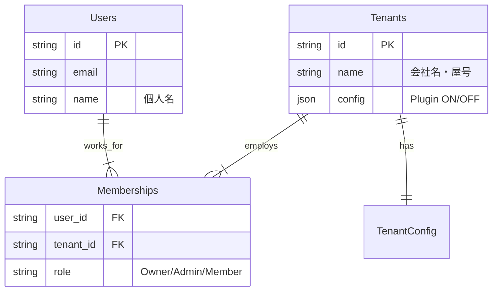

# 登録・利用開始フロー構想 (Registration Strategy)

## 0. 基本思想 (Philosophy)
JBWOSは「求人サイト型アーキテクチャ」を採用する。
**「会社（箱）」と「個人（人）」は完全に別の存在**として扱い、それらを「所属（雇用契約）」で結びつける。

*   **会社 (Company/Tenant)**: 契約主体。プラグイン機能の購入者。業務の指示者。
*   **個人 (User)**: 利用主体。スキルと労働力の提供者。
*   **所属 (Membership)**: 誰が、どの会社で、何の権限で働くか。

## 1. 3つの登録入口 (The 3 Entrances)

ユーザーの属性に合わせて、登録フローを最適化（ショートカット）する。

### A. 一般ユーザー登録 (General User)
*   **対象**: 会社に招待された社員、またはフリーランスとして登録だけしておきたい人。
*   **入力情報**: 氏名、メールアドレス、パスワード。
*   **結果**:
    *   `User` アカウントが作成される。
    *   所属会社はない状態（Freelance）でスタートするか、招待コード入力で会社に参加する。

### B. 個人事業主登録 (Sole Proprietor) - 推奨ショートカット
*   **対象**: 一人親方、フリーランス、自分のお店を持ちたい人。
*   **入力情報**:
    *   **個人情報**: 氏名、メールアドレス、パスワード。
    *   **屋号**: 「〇〇建具店」などの屋号（会社名）。
*   **結果**:
    *   **Step 1**: `User` アカウント作成。
    *   **Step 2**: `Tenant`（屋号）作成。
    *   **Step 3**: 自動的にその屋号の「オーナー（Owner）」として紐付け。
    *   これらが1クリックで完了する。

### C. 会社登録 (Company Registration)
*   **対象**: 法人の代表者、総務担当者が「会社のアカウント」だけ先に作りたい場合。
*   **入力情報**: 会社名、代表メールアドレス（連絡用）、管理パスワード。
*   **結果**:
    *   `Tenant` アカウントが作成される。
    *   ※本来は「管理者ユーザー」が必要なため、実質的には「管理専用ユーザー＋会社作成」のセットとなるが、UI上は「会社を作る」ことにフォーカスする。

## 2. システム内部構造 (Internal Structure)

どの入口から入っても、データベース上の構造は統一される。

## 3. シナリオ例

*   **一人親方の山田さん**:
    *   「個人事業主」入口から登録。
    *   名前「山田太郎」、屋号「ヤマダ建具」を入力。
    *   完了後、すぐに「ヤマダ建具」のオーナーとしてログインし、製造業プラグインをONにして仕事を始められる。

*   **鈴木工務店の社長**:
    *   「会社登録」または「個人事業主（親方）」入口から登録。
    *   会社「鈴木工務店」を作成。
    *   その後、社員の佐藤さんをメールで招待。

*   **社員の佐藤さん**:
    *   招待メールを受け取り、「一般ユーザー」として登録。
    *   ログインすると、既に「鈴木工務店」に所属している状態になる。
