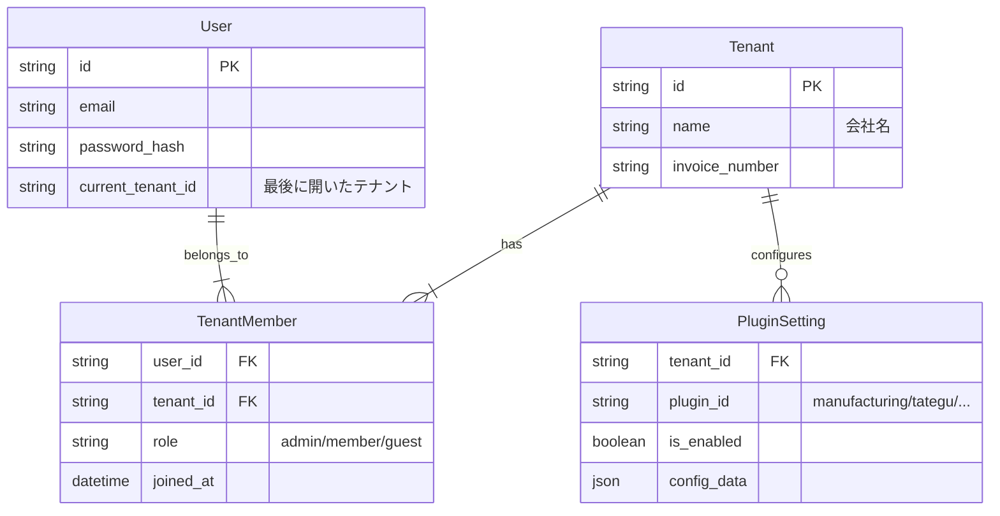

# AI会議議事録: マルチテナント・プラグイン全体設計の見直し

**日時**: 2026-01-23
**参加者**:
- **PM**: プロダクトマネージャー（実用性・UX重視）
- **Arch**: ソフトウェアアーキテクト（構造・拡張性重視）
- **Sec**: セキュリティエンジニア（データ分離・権限重視）
- **Expert**: JBWOS思想（「休める勇気」）の守護者

## 1. 議題定義
ユーザーからの要望：「ユーザーは複数の会社に所属可能」「会社ごとにプラグイン（製造業など）をON/OFFできる」という要件に基づき、システム全体の設計を見直す。JBWOSの思想との整合性を確認する。

---

## 2. 議論：構造とUX

### 2.1 データ構造：User, Tenant, Member
**Arch**: 構造はシンプルに「多対多」で良い。
- **User**: 個人（認証情報、氏名、個人設定）。システム全体でユニーク。
- **Tenant (Company)**: 契約主体。データの器。プラグイン設定を持つ。
- **TenantMember**: UserとTenantの紐付け。Role（Admin/Member）を持つ。

**Sec**: 重要なのはデータの分離だ。会社Aのデータを会社Bの人が見れてはいけない。
- すべてのリソース（Item, Project）は `tenant_id` を持ち、アクセス時に必ず検証する。
- Userはログイン後、**「現在のアクティブTenant」**を選択する（Slack方式）。

### 2.2 プラグインの適用範囲
**PM**: ユーザーの質問「会社Kが製造業プラグインをONにすると、Kに属する社員が影響を受けるか？」
**Arch**: Yes。プラグイン設定は `Tenant` に紐づく。「会社Kのワークスペース」に入っている間、UI/機能は会社Kの設定（製造業モード）になる。

**Expert**: ここで重要なのは**コンテキストの切り替え**だ。
- Aさんが「会社K（製造業）」で仕事をしている時：製造業用のUI（成果物タブなど）が見える。
- Aさんが「会社L（デザイン事務所）」に切り替えた時：製造業UIは消え、デザイン用のUI（あれば）または標準JBWOSになる。
- **思想的整合性**: 「今やるべきこと」に集中させるため、Tenantごとに環境が切り替わるのは正しい。

### 2.3 JBWOS思想（量感・Capacity）との衝突と解決
**Expert**: JBWOSの究極のゴールは「今日はこれで十分」と思えること。「休める勇気」を与えることだ。
もしAさんが「会社K」と「会社L」で働いている場合、会社Kの画面しか見ていないと、会社Lでパンパンに詰まっていることに気づかず、会社Kの仕事を詰め込んでしまうのではないか？

**Arch**: `JBWOS_Enterprise_Architecture.md` の "Private Calendar" 連携の思想を応用しよう。
- **Cross-Tenant Volume (量感の共有)**
    - Aさんが会社Kを見ている時、会社Lの予定は「詳細不明のブロック（Masked Usage）」としてCapacityを減らす要素として機能する。
    - つまり、「詳細は見せないが、忙しさ（Weight）だけは共有する」。

**PM**: それは素晴らしい。副業や複業が当たり前の現代において、個人のリソースは全テナントで奪い合いだ。システムが自動で「あの人は別件（詳細は不明）で忙しい」と判定してくれれば、無理なアサインを防げる。

---

## 3. 全体設計図 (Architecture Overview)

### 3.1 ERモデルイメージ

### 3.2 画面遷移・UXフロー
1.  **Login**: User ID/Passで認証。
2.  **Select Tenant**:
    - 所属が1つならスキップしてホームへ。
    - 複数なら「どこの会社としてログインしますか？」を選択。
3.  **Home (Dashboard)**:
    - 選択したTenantのデータのみ表示。
    - サイドバー等のUIは、そのTenantで有効なプラグインに応じて変化。
    - ヘッダーで「Tenant切り替え」が可能。

---

## 4. 結論
この設計思想で、JBWOSのコアバリュー（集中、量感、休める勇気）を損なうことなく、マルチテナント・プラグイン要件を満たせる。

**アクションアイテム**:
1.  **DBスキーマ拡張**: `tenant_members` テーブル導入、`features` (プラグイン設定) カラムを `tenants` に追加。
2.  **認証フロー修正**: ログイン後に「所属テナント一覧」を取得し、選択させるロジック（まずはデフォルト1つを選択でOK）へ。
3.  **UI実装**: ヘッダー等に会社名表示と切り替えメニューの場所を用意。
