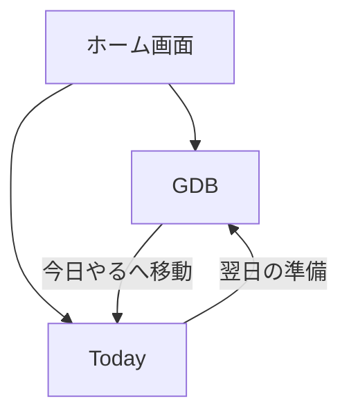

# デザイン仕様書（統合版） v1.0
最終更新: 2026-01-12 (JST)

本ドキュメントは、「GDB詳細設計_純化版」および「Today画面_詳細設計」を統合し、実装可能な単位のUI仕様としてまとめたものである。

---

## 1. 全体構造 (Navigation Structure)

アプリは以下の2つのメイン画面を行き来する構造となる。

1.  **GDB (Judgment)**: 「未来」を決める場所。静的。
2.  **Today (Execution)**: 「今日」を生きる場所。動的。

---

## 2. GDB (Global Decision Board) 詳細仕様

**役割**: 判断（Decision）を完了させるためのボード。
**ルール**: ここには「今日やる」「実行中」などの動的な状態を持ち込まない。

### 2-1. カラム構成 (Columns)

| 名称 (日本語) | 英語キー (Internal) | アイコン | 定義 |
| :--- | :--- | :--- | :--- |
| **受信箱** | `Inbox` | 📥 | 未判断のアイテム。 |
| **カレンダー** | `Scheduled` | 📅 | 日時確定済みの約束。 |
| **判断ボード** | `Decision` | ⚖️ | RDD到達済みの判断対象。 |
| **連絡待ち** | `Waiting` | ⏸️ | 他者ボール。 |

※ 旧 `Ready`, `Execution`, `Done` は GDB から **削除** する。

### 2-2. アクション
*   **Todayに入れる**: アイテムをドラッグ（または右クリック）して「今日やる」に送る。
*   **送られたアイテム**: GDB上からは消える（Today画面へ移動）。

---

## 3. Today画面 (Today Screen) 詳細仕様

**役割**: 今日のCommitを実行し、一日を終えるためのダッシュボード。
**レイアウト**: 縦スクロール構成（3ゾーン）。

### ZONE 1: 今日の判断 (Commit)
*   **最大2件** のアイテムを表示。
*   これらは GDB から送られてきた「今日やる」決意の結晶。
*   順序の入れ替えのみ可能。

### ZONE 2: 今日の実行 (Execution)
*   **Active Context** がある場合のみ表示される。
*   「現在実行中のブロック」を1つだけ表示。
*   完了ボタンのみ存在。

### ZONE 3: 今日の生活 (Life)
*   画面最下部、区切り線の下に配置。
*   **LifeChecklist**:
    *   [ ] 掃除
    *   [ ] 洗濯
    *   [ ] 片付け
*   **非干渉**: ここが未チェックでも ZONE 2 の実行はブロックされない。

### ZONE 4: 今日のログ (Log)
*   完了した今日の成果を表示。

---

## 4. 画面遷移フロー

---

## 5. 次の実装ステップ

1.  **GDBの純化**: 既存の `GlobalBoard` から `Ready`, `Execution`, `Done` カラムを削除する。
2.  **Today画面の実装**: 新しい `TodayScreen.tsx` を作成する。
3.  **ナビゲーション**: ヘッダーまたはサイドバーで GDB / Today を切り替えられるようにする。
4.  **Lifeの実装**: `TodayScreen` 内に独立したコンポーネントとして実装する。

---
