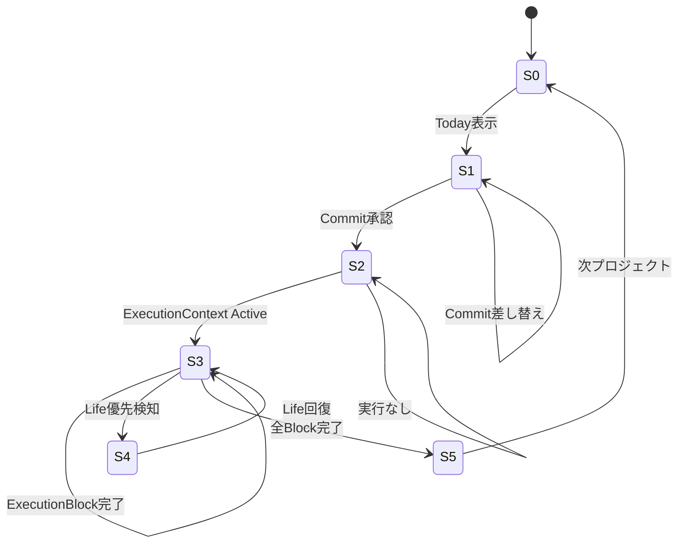

# 画面遷移図・状態遷移設計（State-Based） v1.0
最終更新: 2026-01-12 (JST)

本ドキュメントは、本システムにおける**画面遷移を「状態遷移」として定義**する。
画面は状態の結果であり、ユーザー操作は状態遷移のトリガに過ぎない。

---

## 1. 状態一覧（最小構成）

| State ID | 状態名 | 意味 |
|---|---|---|
| S0 | Idle | 何も確定していない |
| S1 | Today.CommitPending | TodayのCommitが未確定 |
| S2 | Today.Committed | Commit確定済 |
| S3 | Execution.Active | 実行中 |
| S4 | Execution.Paused | Life優先により停止 |
| S5 | Project.Done | プロジェクト完了 |

---

## 2. 状態遷移図（Mermaid）

---

## 3. 各状態で可能/不可能な操作

### S1: Today.CommitPending
- 可能：承認、差し替え
- 不可：Execution選択、Block選択

### S2: Today.Committed
- 可能：Execution自動開始、Progress消化
- 不可：Commit再編集（隠す）

### S3: Execution.Active
- 可能：Block完了
- 不可：Block選択、Context切替

### S4: Execution.Paused
- 可能：Life実行
- 不可：Execution強制再開

---

## 4. 設計原則（重要）

- Inbox / GDB は状態遷移を起こさない
- 状態遷移は**システムが管理**
- 画面遷移は状態変化の結果として発生する

---
