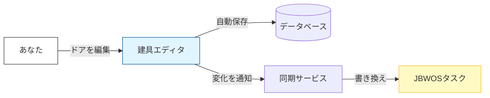

# 自動データ同期機能（Auto Data Sync）説明書

## 概要
「建具（ドア）のデザイン変更」と「自分のタスク（JBWOS）」が自動的につながるようになりました。
もう、エディタで名前を変えた後、タスクリストに戻って名前を書き直す必要はありません。

## 何ができるようになったの？

### 1. 名前が勝手に変わる（Name Sync）
- **エディタで**: ドアの名前を「子供部屋のドア」→「子供部屋のドア（改）」に変更して保存。
- **タスク一覧で**: 自動的にタスク名も「子供部屋のドア（改） 製作」に変わります。

### 2. 見積り時間が勝手に変わる（Estimation Sync）
複雑なデザインにすると、製作にかかる予想時間も増えますよね？これがタスクにも反映されます。

- **エディタで**: 格子を増やしたり、複雑な組子を追加する。
- **裏側で**: 「製作には120分かかりそうだな」と自動計算。
- **タスク一覧で**: そのタスクの「見積時間（Estimated Minutes）」が自動的に `120min` に更新されます。これで「今日の予定」を組むときに、より正確な時間がわかります。

### 3. オートセーブで即同期
- 「保存して戻る」ボタンを押したときはもちろん、**編集中も自動的**に（約1秒ごとに）同期されます。
- 常に最新の状態がタスクボードに反映されます。

---

## 仕組みのイメージ

## 注意点
- **手動でタスク名を変えていた場合**: エディタ側の名前が優先され、上書きされる場合があります（基本は「建具エディタ」が正（マスター）となります）。
- **同期される項目**: 現時点では「タイトル」「見積時間」が同期されます。ステータス（完了など）はタスクボード側の操作が優先されます。
