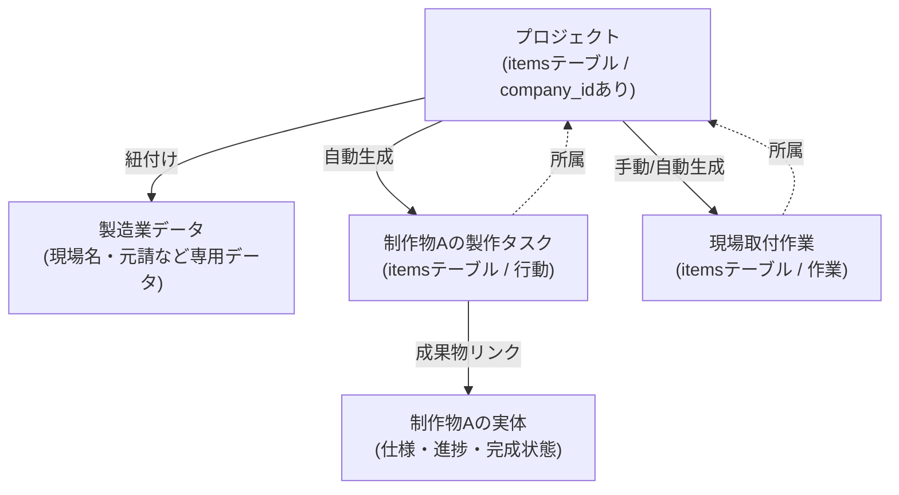

# 製造業統合とコンテキスト管理の設計思想

## 1. アイテムの二面性 (Universal Items)
すべてのタスク、プロジェクト、成果物は `items` テーブルという共通基盤の上に構築されます。

- **基本属性**: ID, タイトル, 納期, 会社ID (NULL=個人, SET=会社), ステータス
- **拡張属性**: 製造業プラグインがONの場合、現場名、元請け、摘要などの業務特有データが紐づく。

## 2. 製造業プロジェクト項目の分類と管理
製造業に特化したデータは、以下の3つのカテゴリで管理されます。

- **制作物 (Fabrication)**: 工場で製作するもの（例：障子戸 A）。
- **現場作業 (Site Work)**: 現場での取り付け、採寸、搬入など。
- **その他 (Other)**: 見積作成、打ち合わせ、事務作業など。

### 統合管理テーブルの仕様 (仮称: `manufacturing_items`)
これら3つのカテゴリは一つのテーブルで管理され、以下の属性を持ちます。

| カラム名 | 説明 |
| :--- | :--- |
| ID | ユニーク識別子 |
| 項目名 | 名称（例：障子戸 A 製作） |
| 所属プロジェクト | 親となるプロジェクトID |
| 担当者 | 割り当てられたユーザー |
| 製作時間 | 工場等での想定作業時間 |
| 現場時間 | 現場での想定作業時間 |
| 労務単価 | 時間あたりのコスト |
| 納期 | 完了期限 |
| メモ | 補足情報 |
| 画像 | 参考図面や写真のパス/URL |

## 3. データの同期とオートメーション
「製造業項目」と「アイテム (`items` テーブル)」は密接に連動します。

- **1:1 または 1:N の連動**: 製作物を登録すると、対応する「タスク（アイテム）」が自動生成されます。
- **同期項目**: 名前、納期、ステータスなどが双方向に同期されることを目指します。
- **実績のフィードバック**: タスクが完了（Done）になると、製造業側の実績時間として記録される、または進捗率が更新される。

## 4. 時間管理と負荷の俯瞰 (Resource Planning)
一つの項目に「製作時間」と「現場時間」の両方が混在することを許容します。

- **例**: 
    - アイテムA: 製作1時間、取付1時間
    - アイテムB: 製作2時間、取付3時間
- **集計のメリット**: 
    - 「明日は製作に合計3時間かかるな」
    - 「取付の日はAとBをまとめて運んで、合計4時間の現場作業だな」
といった、工程ごとの合計負荷を一目で把握できるようになり、人員配置や配送計画の判断を助けます。

## 5. アーキテクチャ図 (Mermaid)

## 6. プロジェクト一覧・ダッシュボードの表示要件
ユーザーの状態（コンテキスト）に応じた柔軟な表示切り替えをサポートします。

### 表示モード
1. **ステータス分類モード** (デフォルト):
   - アイテムの状態（Inbox, Today, Calendar等）で分類して表示。
2. **フラット表示モード**:
   - 状態による分類をオフにし、リストとして表示。

### ソート・グルーピング
- **会社別ソート**: 所属する会社ごとにプロジェクト/アイテムをまとめて表示。
- **納期別ソート**: 納期の早い順に時系列で表示。

## 7. 個人(Personal) と 会社(Company) の厳格な分離
- **基本(Personal)タブ**: `company_id` が NULL のアイテムのみを表示。
- **会社(Company)タブ**: `company_id` が設定されているアイテムを会社ごとに表示。
- **新規作成**: 現在開いているタブに応じて、適切な入力モーダル（簡易 or 業務特化）を出し分ける。
