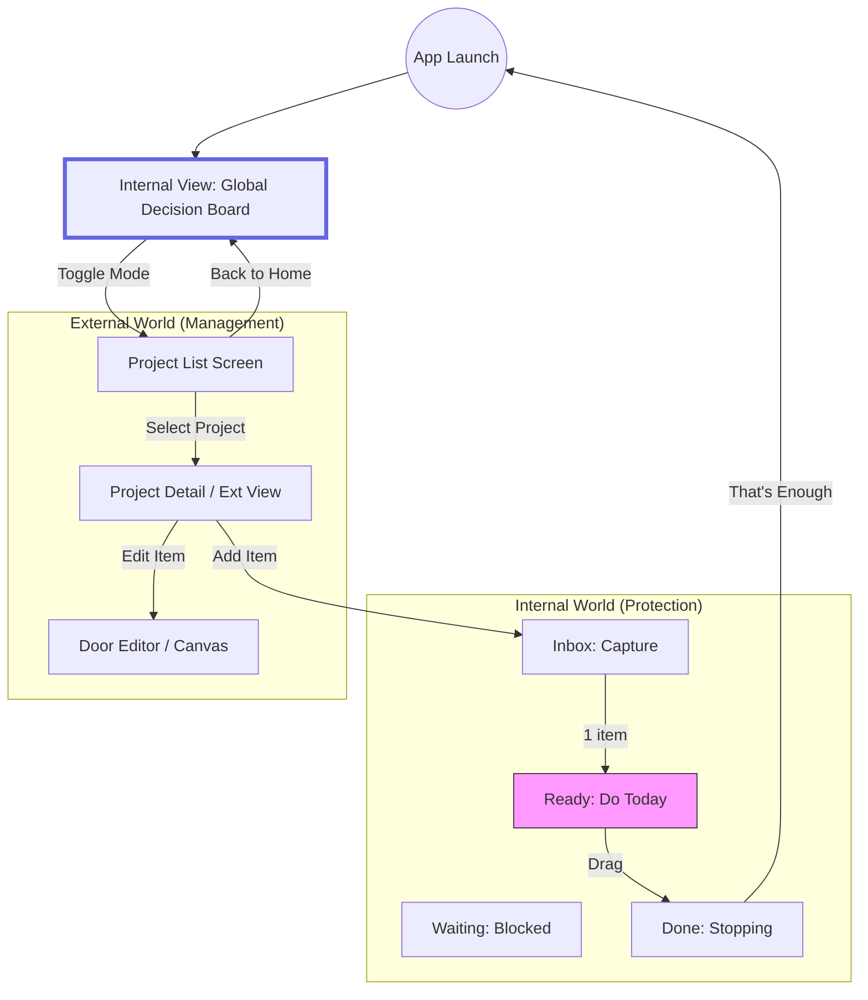

# 基本設計書: Judgment OS (v1)

**作成日**: 2026-01-11
**概要**: Global Decision Board を中心とした新アーキテクチャの全体像を定義する。

## 1. 全体フロー図 (Architecture Overview)



## 2. 画面一覧 (Screen Definitions)

| 画面名 | 役割 (Role) | 構成要素 (Components) |
|---|---|---|
| **Global Decision Board** | **[HOME]** 判断管理 | ・4バケツ (Inbox, Ready, Waiting, Pending)<br>・Global Ready Counter<br>・Inbox Protection Banner<br>・Project Tag |
| **Project List Screen** | プロジェクト管理 | ・プロジェクト作成/削除<br>・プロジェクト一覧 (Card)<br>・対外説明遷移ボタン |
| **Project Detail (Ext)** | 対外説明・編集 | ・従来のカンバン/ガント<br>・アイテム追加<br>・状況報告生成<br>・DXF出力 |
| **Door Editor** | 詳細設計 | ・Canvasエディタ<br>・見積もり情報 |

## 3. 状態遷移と制約 (Rule Constraints)

### 3.1 Global Ready Limit
- **ルール**: 全プロジェクトの `status='ready'` のアイテム総数は **常に2件以下** でなければならない。
- **制御**:
    - Inbox -> Ready へのドラッグ時、 `count(Ready) >= 2` ならば操作をキャンセルし、「今日はこれで十分です」とトースト表示。

### 3.2 Inbox "No-Compare" View
- **ルール**: Inbox は比較検討させてはならない。
- **制御**:
    - `count(Inbox) > 7` の場合、リスト全体をオーバーレイで隠す。
    - メッセージ: 「今日はInboxから1件選べば十分です」。
    - ユーザーがクリックして初めてリストが見える（能動的な「取り出し」動作）。

### 3.3 The "Stopping" Event
- **トリガー**: `Ready` にアイテムがあった状態から、全て `Done` に移動し `count(Ready) == 0` になった瞬間。
- **アクション**:
    - 画面中央にモーダル/バナー表示: **「今日はもう、やるものはありません」**
    - Inbox への誘導（「次は？」）を一切表示しない。

## 4. データ構造 (Data Model Update)

既存の `Door` エンティティをそのまま利用するが、クエリ戦略を変更する。

- **Fetch**: `db.doors.toArray()` (全件取得)
- **Join**: `projectId` をキーに `db.projects` から `name` を取得し、メモリ上で結合して表示用オブジェクト (`DoorWithProject`) を生成。
- **Filter**: `judgmentStatus` で 4つのバケツに振り分け。

```typescript
interface DoorWithProject extends Door {
    projectName: string;
    projectColor?: string; // プロジェクト識別用
}
```
